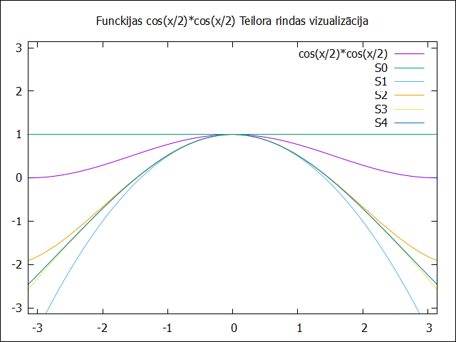

    Artūrs Kiseļevskis RECVO1. grupa 03.12.2023
# 1. Laboratorijas darbs - Teilora rindas
## Ievads
Teilora rinda ir funckijas attēlošanas veids, kurā tā tiek attēlota, kā bezgalīgi daudzu elementu summa, kuri izveido funckiju, kura pie maziem argumentiem, ir praktiski identiska oriģinālfunckijai.

Teilora rinda ir funckijas aptuvenās vērtības noteikšanas rīks. Tā sastāv no no bezgalīga daudzuma elementu summas. Šie elementi ir n-tās kārtas atvasinājumi punktā a.
Ja a = 0, šo rindu sauc par Maklaurina rindu, kurā funckijas vērtība pie maziem argumentiem, ir praktiski identiska oriģinālfunckijai. 
## Programma
Lai iegūtu vajadzīgo rezultātu

Koda izvade pie argumenta vērtības x = 0.5:

## Datu vizualizācija
Funckiju vizualizēšanai tika izmantots Gnuplot, kurā tika attēlota oriģinālfunckija cos(x/2)*cos(x/2), kā arī Teilora rindas pirmās 5 iterācijas (no 500). Attēls:

Gnuplot kodu var atrast šeit: 
https://github.com/akiselevskis/RTR105/tree/main/darbi/ld1_series/taylor.gp.

## Atsauces
