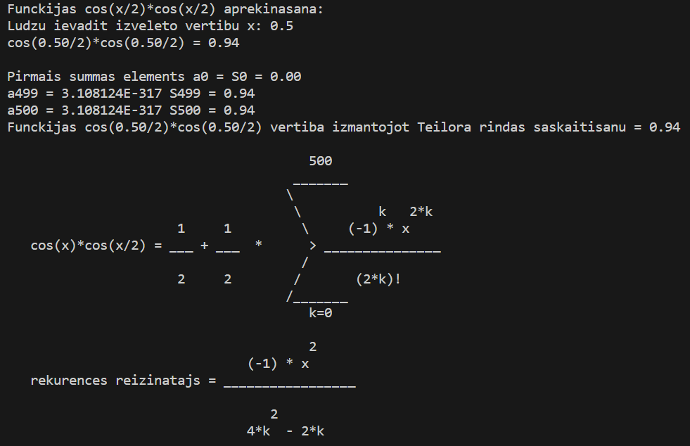

    Artūrs Kiseļevskis RECVO1. grupa 03.12.2023
# 1. Laboratorijas darbs - Teilora rindas
## Ievads
Teilora rinda ir funkcijas aptuvenās vērtības noteikšanas rīks. Tā sastāv no bezgalīga daudzuma elementu summas. Šie elementi ir n-tās kārtas atvasinājumi punktā a.
Ja a = 0, šo rindu sauc par Maklaurina rindu, kurā funkcijas vērtība pie maziem argumentiem, ir praktiski identiska oriģinālfunckijai.

Teilora rindas pielietojuma skaidrības pēc, tika veikta funkcijas vizualizēšana. Tika izmantots Gnuplot, kurā tika attēlota oriģinālfunkcija cos(x/2)*cos(x/2), kā arī Teilora rindas pirmās 5 iterācijas (no 500). Attēls:

## Programma
Teilora rinda oriģināli ir bezgalīgu elementu summa, bet tā kā atvasināt katru elementu atsevišķi nav praktiski, tiek lietots cits veids. Skat. attēlu:

Dotajā attēlā attēlota funkcijas cos(x/2)*cos(x/2) Maklaurina rinda. Funckija zem summas zīmes, tiks saukta par summas elementu.

Pirms programmas izveides tika aprēķināts rekurences  reizinātājs - (k summas elements)/(k-1 summas elementu). Ar šo koeficientu (kurā tiks ievietots katra elementa kārtas skaitlis - k) var noskaidrot cik reizies atšķiras katrs nākošais summas elementa a elements no iepriekšējā.

Programmu sāk ar a(0) un S(0) aprēķināšanu, ievietojot jau iepriekš aprēķinātajā elementa formulā k=0. Katru nākošo elementu iegūst piereizinot iepriekšējajam elementam rekurences reizinātāju, kur k vietā ir šīs iterācijas kārtas skaitlis. Visus elementus saskaita kopīgā summā (šajā laboratorijas darbā ir 500 elementi) un veic pēdējo formulas apstrādi pēc Maklaurina rindas formulas.

Koda izvade pie argumenta vērtības x = 0.5:

## Datu analīze

Programmā ievietots arī kļūdas pārbaudes mehānisms. Programmas sākumā oriģinālfunckijas vērtība tiek aprēķināta ar C bibliotēku <math.h> un beigās - tiek parādīta funckijas vērtība pēc Teilora rindas estimācijas. Tā kā funckijas vērtība kļūdas robežās ir vienāda pie visām x vērtībām, var secināt, ka programma darbojas pareizi. Vēl, var redzēt, ka a499 un a500 ir bezgalīgi mazas vērtības, kas sakrīt ar Teilora rindas definīciju. Kļūdu var novērot pie pie a499 un a500 izvades. Tā kā rekurences reizinātājs ir negatīvs, a499 un a500 vajadzētu būt dažādām zīmēm, bet abi skaitļi ir pozitīvi. Šo kļūdu visticamāk var novērst izmantojot citus datu attēlošanas precizētājus %LE vietā.

## Secinājumi

Laboratorijas darbs parāda Teilora rindas lietderību situācijās, kur datoriem nepieciešams aprēķināt abstraktākus matemātikas jēdzienus. Darba laikā tika padziļinātas C valodas zināšanas, stiprinātas Gnuplot prasmes, kā arī trenēta matemātiskā un analītiskā domāšana.

## Atsauces
1) https://estudijas.rtu.lv/file.php/360800/RTR105_2019_2020_L18_20200118_14_50.pdf (03.12.23)
2. https://www.britannica.com/science/Taylor-series (03.12.23)