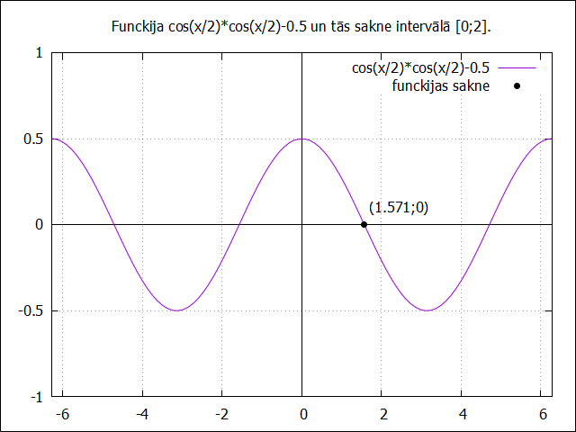
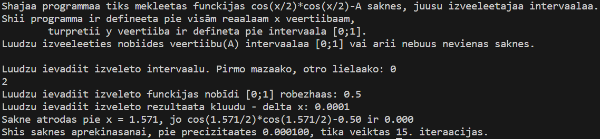

    Artūrs Kiseļevskis RECVO1. grupa 18.12.2023
# 2. Laboratorijas darbs - Dihotomijas metode
## Ievads
Funkcijas saknes ir punkti, kuros funkcijas vērtība pieskaras vai šķērso X asi. Ass šķērsošanas gadījumā atklājas īpašība - ļoti tuvu punktu, kas atrodas pa kreisi un pa labi no šīs saknes, funkcijas vērtībām būs atšķirīgas zīmes. Var secināt arī, ka šo funkciju vērtību reizinājums būs negatīvs skaitlis.

**Dihotomijas metode**[1] ir funkcijas sakņu atrašanas metode, kas salīdzina funkcijas divu punktu vērtību reizinājumu zīmi, lai atrastu sakni. Funkcijas saknes precīzākai noteikšanai, tiek samazināts intervāls starp funkciju punktiem, kuros tiek rēķinātas šīs vērtības, līdz brīdim, kad sakne kļūst pozitīva (liecinot, ka abi punkti atrodas vienā saknes un X ass pusē).[2]

Skat. ar Gnuplot rīku izveidoto grafiku, kurā attēlota funkcija cos(x/2)*cos(x/2)-0.5 un tās sakne intervālā [0;2]:

*Gnuplot ģenerātais grafiks, kurā attēlotas oriģinālfunkcijas sakne intervālā [0;2] ar nobīdes vērtību A = 0.5 [3]*

## Programma

Programmas mērķis ir atrast funkcijas cos(x/2)*cos(x/2)-A saknes lietotāja noteiktajā intervālā, ņēmot vērā lietotāja noteiktās programmas darbības specifikācas.
Programma sākas ar izmantotās funkcijas definējumu, koda atvieglošanas iemeslu dēļ. Notiek dialogs ar lietotāju funkcijas intervāla, nobīdes un precizitātes mainīgo iegūšanai. Tiek paskaidrots funkcijas vērtības apgabals un tas pie kādām nobīdes vērtībām funkcijai būs saknes (kā arī aizliegts izvēlēties nobīdes vērtību ārpus šī intervāla).[1]

Funkcija darbojas iepriekš paskaidrotajā veidā - tiek salīdzināta intervāla tālāko punktu vērtību reizinājumu zīme ar 0. Ja tā ir pozitīva, programma beidz darbību ar paziņojumu, ka šajā intervālā ir pāra skaits sakņu vai arī sakne ir tikai pieskare, jeb nešķērso X asi. Ja reizinājums ir negatīvs, tiek aktivizēts cikls, kurā tiek samazināts intervāla lielums ar īpatnēju metodi, kurā intervālā vienmēr tiek paturēta sakne (arī salīdzinot reizinājumu ar 0). Cikls terminējas, kad punktu attālumu starpība ir mazāka par pieprasīto precizitāti. Tiek izdota atbilde (saknes vērtība), kā arī funkcijas vērtība pie šīs x vērtības un nepieciešamo iterāciju skaits pie pieprasītās precizitātes.

Datu izvade pie ievadītajām vērtībām - a = 0, b = 2, A = 0.5, precizitate = 0.0001:

*Programmas datu izvades paraugs [4]*

## Datu analīze

Programma tika testēta pie vairākiem intervāliem, nobīdes vērtībām un precizitātēm (ieskaitot negatīvās vērtības) un programma darbojās kā tai ir paredzēts. Papildus pārbaudi var redzēt pēdējā solī, kurā tiek aprēķināta funkcijas vērtība pie iegūtās saknes. Tā kā rezultāts vienmēr ir 0 vai tuvu tai (ar pietiekami augstu precizitāti), var secināt, ka tiek pareizi noteikta sakne un programma ir precīza. Ievadā norādītajā grafikā tiek attēlota programmas sekmīgas darbības vizualizācija (saknes vērtība tika iegūta ar programmu).

Lai gan dihotomijas metode ir ļoti ierobežojoša sakņu noteikšanas metode, jo darbojas tikai noteiktās situācijās, un būtu ieteicams izmantot citas metodes sakņu noteikšanai precīzākā veidā (piemēram, diskriminanta), šī laboratorijas darba ietvaros, uzdevums ir veikts kā ieplānots.

## Secinājumi

Laboratorijas darbs - Dihotomijas metode, dod iespēju novērot matemātisku jēdzienu paskaidrošanu datoriem. Tika panākti noteiktie mērķi, pārbaudīta programmas precizitāte un nosacījumi, un iegūtas un nostiprinātas ar tēmu saistītās zināšanas un iemaņas, tā pastiprinot datormācības un matemātikas pamatus.

## Atsauces un saites uz kodiem
1. https://estudijas.rtu.lv/file.php/360800/RTR105_2019_2020_L18_20200118_14_50.pdf (18.12.23)
1. Burden, R., Faires, J., & Burden, A. (2015). Numerical Analysis. Cengage Learning. (18.12.23)
https://faculty.ksu.edu.sa/sites/default/files/numerical_analysis_9th.pdf (18.12.23)
1. Saite uz attēlu: https://github.com/akiselevskis/RTR105/blob/main/darbi/2ld_roots/roots.png \
   Saite uz kodu: https://github.com/akiselevskis/RTR105/blob/main/darbi/2ld_roots/roots.gp
1. Saite uz attēlu: https://github.com/akiselevskis/RTR105/blob/main/darbi/2ld_roots/koda_izvade_roots.png \
   Saite uz kodu: https://github.com/akiselevskis/RTR105/blob/main/darbi/2ld_roots/roots.c

