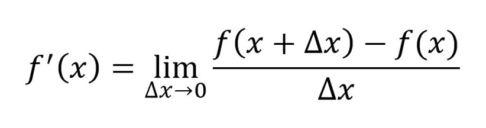
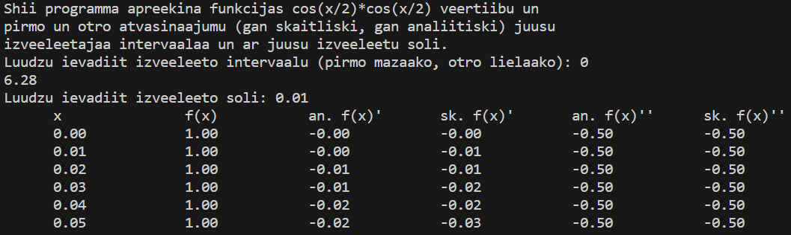
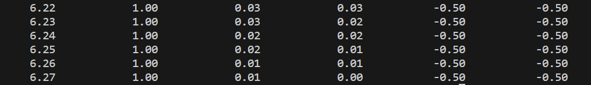
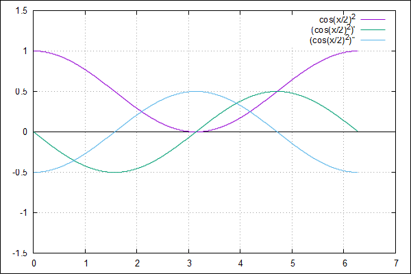
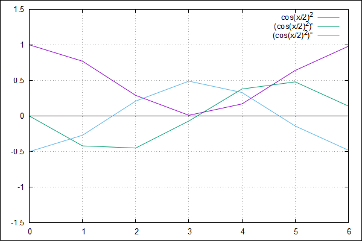
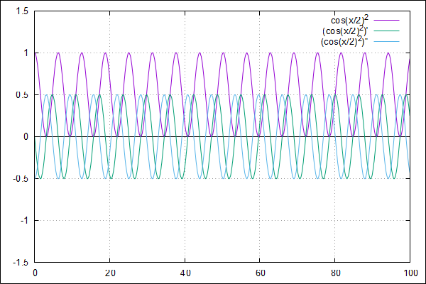

    Artūrs Kiseļevskis RECVO1. grupa 03.01.2024
# 3. Laboratorijas darbs - Skaitliskā diferencēšana
## Ievads

Funkcijas atvasinājums[1] ir funkcijas vērtības izmaiņa atkarībā no bezgalīgi mazas izmaiņas funkcijas argumenta vērtībā. Tas parāda to, cik strauji izmainās funkcijas vērtība atkarībā no izmaiņas argumenta vērtībā. Ja funckijas vērtība aug - funkcijas atvasinājums ir pozitīvs, ja dilst - atvasinājums ir negatīvs un ja funkcijas vērtība ir paralēla x asij (ne dilst, ne aug) - atvasinājuma vērtība ir 0. Tas pats attiecas uz funckijas atvasinājuma un atvasinājuma atvasinājuma atkarību (otrās pakāpes atvasinājums un tālāk). Funkcijai nav atvasinājuma visos punktos, ja funkcija ir pārtraukta vai tai ir asi stūri (precīzu funkcijas atvasinājumu tajos punktos nav iespējams noteikt, jo funkcijas sastāv nemainās vienmērīgi).[2]

Šajā laboratorijas darbā tiek pētīta un vizualizēta funkcijas cos(x/2)*cos(x/2) pirmās un otrās pakāpes atvasinājums gan ar skaitlisko, gan ar analītisko veidu, lietotāja noteiktā veidā.

Apskatītās atvasināšanas metodes:
* Analītiskā metode - funckija tiek iepriekš atvasināta, izmantojot atvasināšanas formulas un likumus.
* Skaitliskā metode - funkcijas tiek atvasināta pēc definīcijas, jeb (funkcija(x + x_izmaiņa) - funkcija(x)) / x_izmaiņa.

## Programma
Programma informē lietotāju par tās darbības principu un veic dialogu, pieprasot nepieciešamos mainīgos programmas darbībai - intervāla sākumpunktu, beigupunktu un soli (katra nākošā punkta attālumu). Programma tiek sadalīta vairākās atsevišķās funkcijās, lai programmā bezjēdzīgi neatkārtotu sekcijas un lai tās darbību varētu vieglāk uztvert. Šīs sekcijas ir pirmās un otrās kārtas atvasinājumi pēc definīcijas (skaitliskā metode) un ar iepriekš aprēķinātu atvasinājuma vērtību (analītiskā metode). Programma izdod terminālī prasītās vērtības, kā arī atver failu ar nosaukumu derivative.dat, kurā ieraksta šīs pašas vērtības. Programmas beigās fails tiek aizvērts. Kopā ar programmu nāk arī Gnuplot programma, kuru palaižot var aktivizēt programmas vizualizāciju, kas nolasa datus no datu faila un izveido .png failu ar doto datu vizualizāciju.

*Jāņem vērā, ka C programma ieraksta vērtības datu failā tikai, ja programma tiek kompilēta kā .exe dokuments, nevis .out.*

Koda izvades paraugs:

Turpinājums...

*Koda izvade pie ievades intervāla (0, 6.28) un soļa 0.01.*

## Datu analīze
Salīdzinot datu izvades analītiskos un skaitliskos atvasinājumus var secināt, ka programma strādā kā paredzēts, jo pirmās un otrās kārtas atvasinājumu skaitlisko un analītisko atvasinājumu vērtības sakrīt pie dotās precizitātes, pierādot, ka programma strādā precīzi pie abām atvasināšanas metodēm.
Pirmās un otrās pakāpes pareizu darbību pierāda arī sakritība ar atvasinājuma pazīmēm, kas tika raksturotas ievadā - funkcijas vērtības zīme (pozitīva, negatīva vai paralēla x asij) tieši ietekmē atvasinājuma monotonitāti (augošs, dilstošs vai 0). Funkcija ir nepārtraukta, kas nozīmē, ka atvasinājumi eksistē visos punktos (kas sakrīt ar vizualizāciju).

Funkcija tika palaista ar dažādām ievadītajām vērtībām un tad vizualizēta, lai pārliecinātos par tās pareizu darbību. Lūk daži mēģinājumi:

*Programmas Gnuplot vizualizācija pie ievadītā intervāla (0, 6.28) un soļa 0.01.[1]*

*
Programmas Gnuplot vizualizācija pie ievadītā intervāla (0, 6.28) un soļa 1.[1]*

*
Programmas Gnuplot vizualizācija pie ievadītā intervāla (0, 100) un soļa 0.1.[1]*

## Secinājumi
Laboratorijas darbs "Skaitliskā diferencēšana" ir labs ieskats atvasināšanas matemātiskajos principos un tās paskaidrošanai datoram saprotamā veidā. Laboratorijas darbs, ieskaitot programmu un vizualizāciju, tika veikts sekmīgi un pilda savas prasības. Darba laikā tika padziļinātas matemātiskās un analītiskās prasmes, kā arī zināšanas datorzinībās (it īpaši - darbs ar dokumentiem). 

## Atsauces un saites uz kodiem
1. https://estudijas.rtu.lv/file.php/360800/RTR105_2019_2020_L19_20200118_14_50.pdf (03.01.24)
1. https://mathworld.wolfram.com/Derivative.html (03.01.24)
1. 