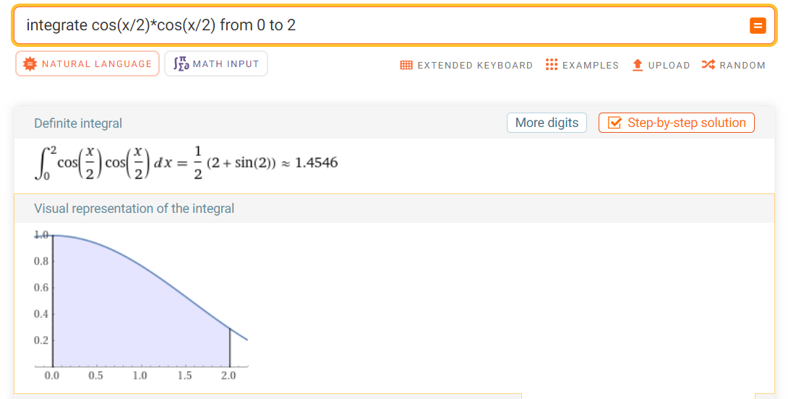

    Artūrs Kiseļevskis RECVO1. grupa 10.12.2023
# 4. Laboratorijas darbs - Skaitliskā integrēšana
## Ievads

Tāpat kā riņķa līnijas laukuma vērtību var pieņemt kā vienādu ar bezgalīga daudzuma stūru daudzstūri, kas veido riņķa formu, jebkuru laukumu var uzskatīt par vienādu ar bezgalīgu daudzumu laukumu summu. Tā ir noteiktās integrēšanas pamatideja.

Šajā laboratorijas darbā tiek apskatītas trīs laukuma sadalīšanas metodes:
1) Taisnstūra metode
Laukums tiek sadalīts taisnstūros, kuru augstums ir vidusspunkts nogrieznim, kas vilkts no viena nodalījuma funckijas vērtībai šajā punktā, līdz nākošajā nodalījuma funckijas vērtībai šajā punktā.
2) Trapeču metode
3) Simpsona metode

## Programma
Programmas sākumā tika atdalīta oriģinālfunkcija un aprēķināta ar atsevišķu funkcju. Tas ticis darīts, lai katrā darbībā nevajadzētu rakstīt visu funckiju, bet pietiktu ar viena mainīgā aizsūtīšanu uz "funckija" funckiju, kur vērtība tiks aprēķināta un atgriezta. Tad tiek deklarēti mainīgie un norisinās dialogs ar lietotāju, lai iegūtu noteiktā integrāļa intervāla sākuma (*a*) un beigu (*b*) intervāla vērtības, kā arī precizitāti (*precizitate*). Funckijas pamatideja ir sekojoša - laukums tiek sadalīts n vienādās horizontālās sadaļās. Ar vienu no ievadā minētajām metodēm, tiek iegūts katras atsevišķās sadaļas laukums un saskaitīta pie kopējās summas (tiek iegūta noteiktā integrāļa vērtība). Precizitāte tiek noteikta, salīdzinot 

Koda izvade pie ieejas vērtībām a = 0, b = 2, precizitate = 0.00001:

.png>)

## Datu analīze

Wolframalpha pārbaude: 

## Secinājumi

## Atsauces un saites uz kodiem