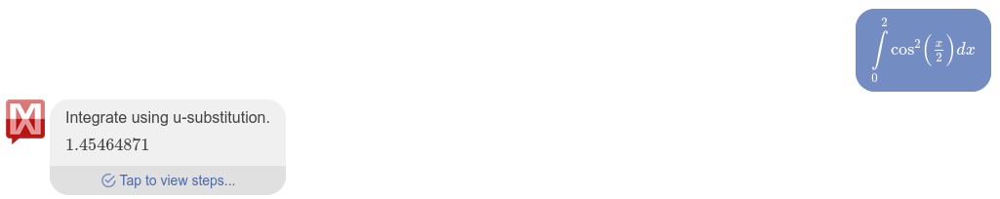

    Artūrs Kiseļevskis RECVO1. grupa 10.12.2023
# 4. Laboratorijas darbs - Skaitliskā integrēšana
## Ievads

Tāpat kā riņķa līnijas laukuma vērtība ir praktiski vienāda ar bezgalīga daudzuma stūru daudzstūri, kas veido riņķa formu (skat. 1. attēlu), jebkuru laukumu var uzskatīt par vienādu ar bezgalīgu daudzumu laukumu summu. Tā ir noteiktās integrēšanas pamatideja.

*1. attēls - Riņķa līnijas laukuma estimācija ar kvadrātiem[1]*

Sākumā laukums ir ļoti neprecīzs, bet samazinot atsevišķo elementu laukumus un palielinot to skaitu vai arī izmantojot citas formas (kas vairāk līdzinās nepieciešamajai formai), var iegūt daudz tuvāku, ja ne praktiski identisku, rezultātu.
 
Šajā laboratorijas darbā tiek apskatītas trīs laukuma sadalīšanas metodes:
1) Taisnstūra metode
2) Trapeču metode
3) Simpsona metode

**Taisnstūra metodē**, laukums tiek sadalīts taisnstūros, kuru augstums ir vidusspunkts nogrieznim, kas vilkts no nodalījuma sākumpunkta funckijas vērtības, līdz nākošā nodalījuma sākumpunkta funckijas vērtībai. **Trapeces metode** ir ļoti līdzīga, turpretī augstums vairs nav paralēls x asij, bet gan ir slīpne. Šī slīpne ir tas pats, iepriekšminētais nogrieznis. **Simpsona metode**, savukārt, dod vēl precīzākus rezultātus, jo tā izmanto polinomu aproksimāciju starp funkcijas punktiem.[2]

Kopējais laukums tiek aprēķināts, saskaitot visu sadaļu laukumus.

## Programma
Programmas sākumā tika atdalīta oriģinālfunkcija un aprēķināta ar atsevišķu funkcju. Tas ticis darīts, lai katrā darbībā nevajadzētu rakstīt visu funckiju, bet pietiktu ar viena mainīgā aizsūtīšanu uz "funckija" funckiju, kur vērtība tiks aprēķināta un atgriezta. Tad tiek deklarēti mainīgie un norisinās dialogs ar lietotāju, lai iegūtu noteiktā integrāļa intervāla sākuma (*a*) un beigu (*b*) intervāla vērtības, kā arī precizitāti (*precizitate*). Funckijas pamatideja ir sekojoša - laukums tiek sadalīts vienādās horizontālās sadaļās ar garumu h. Ar vienu no ievadā minētajām metodēm, tiek iegūts katras atsevišķās sadaļas laukums un tiek pieskaitīts pie kopējās summas (tiek iegūta noteiktā integrāļa vērtība). Šī darbība strādā *while* ciklā, kurā integrāļa aproksimācija tiek salīdzināta ar lietotāja ievadīto precizitāti, un ja absolūtā vērtība ir lielāka par precizitāti, tad divas reizes tiek palielināts mainīgais *n*, kas samazina katra soļa (*h*) garumu, tādā veidā padarot aproksimāciju vēl precīzāku. Šis kods turpina atkārtoties līdz precizitāte tiek sasniegta. Tiek izdots rezultāts un programma dodas pie nākošās metodes vai arī beidz darbību.[3]

Koda izvade pie ieejas vērtībām a = 0, b = 2, precizitate = 0.00001:

.png>)

*2. attēls - Koda izvade[4]*

Doto situāciju var vieglāk vizualizēt ar Gnuplot funckiju, kas iekrāso laukumu starp oriģinālfunckijas cos(x/2)*cos(x/2) līkni un X asi robežās no 0 līdz 2: 

*3. attēls - Gnuplot ģenerētais attēls[5]*

## Datu analīze

Lai pārbaudītu funckijas darbību, tika izmantota WolframAlpha tīmekļa vietne. Sākumā funckija tika pārbaudīta ar iepriekš minēto intervālu (0;2).

Wolframalpha pārbaude: 

*4. attēls - Datu analīze ar WolframAlpha[6]*

Gan grafika līdzība ar Gnuplot ģenerēto grafiku, gan vērtības sakritība ar koda izvadi, pierāda, ka programma strādā kā tai ir paredzēts. Programma tika pārbaudīta un salīdzināta ar WolframAlpha arī pie negatīvām vērtībām un dažādām precizitātēm un arī darbojās tai paredzētajā veidā. Papildus informāciju varēja iegūt pārbaudot funckiju ar Mathway tīmekļa vietni:

**CUT IT** ///////////////////////////////////////////////////////////

*5. attēls - Datu analīze ar Mathway [7]*

Šeit redzams, ka funckijas vērtība Mathway vietnē tiek attēlota ar vairāk cipariem aiz komata nekā WolframAlpha, kas ļauj mums pārliecināties (salīdzinot ar datu izvadi), ka programma iegūst visprecīzāko rezultātu ar Simpsona metodi, kā tam arī vajadzētu būt.

## Secinājumi

Šis laboratorijas darbs parāda integrēšanas essenci, kā arī dod vieglāku izpratni par to, kā dators spēj to uztvert. Tiek attīstītas iemaņas optimizācijā un precizitātes novērtēšanā un uzlabošanā, kā arī uzlabotas spējas ciklu pielietošanā. Programma darbojas kā tai ir paredzēts un ir novērojamas atšķirības katrai laukuma sadalīšanas metodei.

## Atsauces un saites uz kodiem
1. https://www.researchgate.net/figure/The-approximation-of-a-circle-a-the-original-domain-of-the-circle-and-its-approximated_fig6_223711108
1. https://estudijas.rtu.lv/file.php/63844/Skaitliskas_metodes/not.int.aprek.pdf
1. https://estudijas.rtu.lv/file.php/360800/RTR105_2019_2020_L20_20200118_14_51.pdf
1. dw
1. https://www.wolframalpha.com/input?i=integrate+cos%28x%2F2%29*cos%28x%2F2%29+from+0+to+2
1. https://www.mathway.com/Calculus