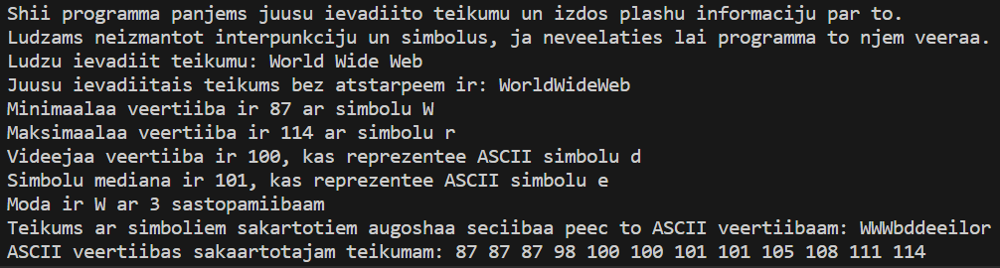
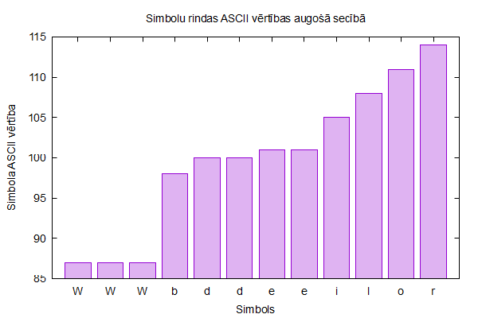
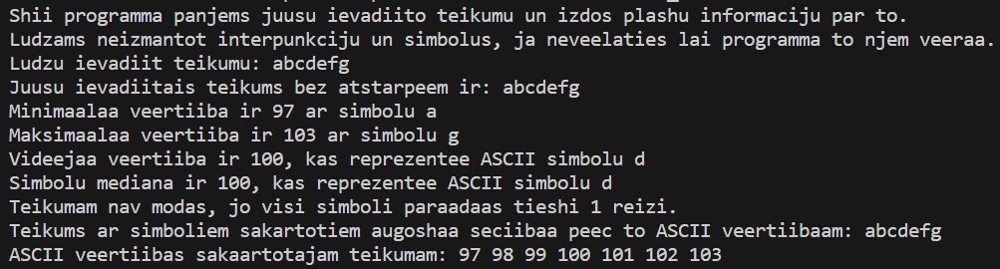
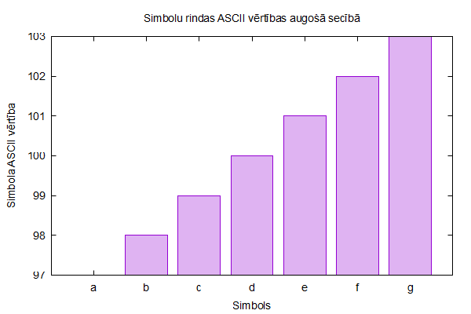
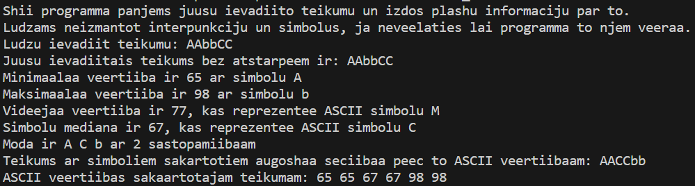
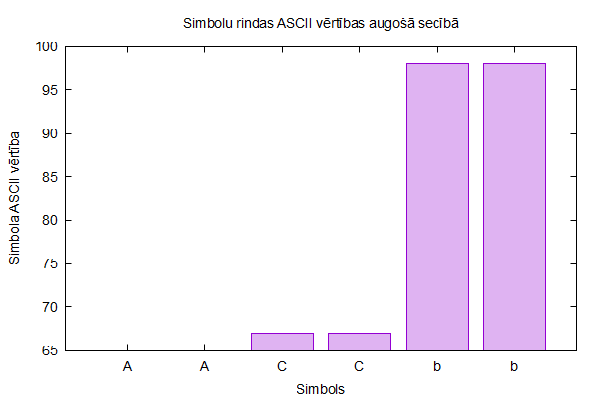

    Artūrs Kiseļevskis RECVO1. grupa 06.01.2024
# 5. Laboratorijas darbs - Skaitļu kopas kārtošana un statistika
## Ievads

Laboratorijas darbā[1] tiek apskatītas vairākas datu analīzes un statistikas metodes un apstrādātā informācija tiek sakārtota viegli saprotamā, izskaidrotā veidā un tiek vizualizēta. Programmas darbības sapratnei, tiks paskaidroti galvenie termini.

Laboratorijas darbā aplūkotie datu analīzes jēdzieni:
* minimālā vērtība - mazākā no vērtībām, 
* maksimālā vērtība - lielākā no vērtībām, 
* vidējais aritmētiskais lielums - vērtību summa dalīta ar vērtību skaitu,
* mediāna - sakārtojot vērtības augošā secībā, vidējais elements (ja ir pāra skaits elementu, tad vidējo divu elementu summa dalīta ar divi).

## Programma

Programma izskaidro tās darbību un pielietojumu un veic dialogu ar lietotāju, lai iegūtu tai nepieciešamās vērtības. Lietotājs var ievadīt jebkuru teikumu vai simbolu rindu (ar vai bez atstarpēm un ar mazajiem vai lielajiem burtiem). Programma nolasa visus simbolus līdz tiek nospiesta poga "Enter", kas pārtrauc datu ievadi. Programma noņem atstarpes un rindas beigu simbolu un atdod simbolu rindu lietotājam, lai var pārliecināties, ka tā strādā kā paredzēts.

Programma sāk savu galveno darbību - analizē un sistemātiski sakārto datus, pēc ievadā paskaidrotajām statistikas metodēm. Katra atsevišķā darbība tiek atdalīta atsevišķā funkcijā, lai paturētu programmas pārskatāmību un novērstu apgrūtinošu daudzumu mainīgo izmantošanu. Vietās, kur atkārtoti jāattēlo tā pati informācija vairākas reizes - funkcijas vērtība tiek saglabāta mainīgajā ar intuitīvu nosaukumu, lai novērstu atkārtojošas programmas darbības un samazinātu programmas domāšanas laiku.

Programmas galvenā vērtību mērvienība ir simbolu ASCII vērtība. Viegli pārskatāma tabula pieejama šeit: https://theasciicode.com.ar/. Ar šīm, jau piešķirtajām vērtībām, dati tiek analizēti un sakārtoti.

Katra metode pielieto vairākus nosacījuma operatorus. Īpatnējākās ir "bubbleSort" un "moda" funkcijas. "bubbleSort" izmanto burbuļu metodi, lai sakārtotu simbolus augošā ASCII secībā, samazinot domāšanas laiku. "moda" izmanto gudrus mainīgos, kas uztur specifisku informāciju, kas ietekmē nākošos nosacījuma operatorus. Par modu tiek uzskatīti tikai tie simboli, kas pārādās teikumā **vairāk** par vienu reizi.

Programma izdod informāciju skaidrā, lietotājam saprotamā veidā, kā arī ienes augošā secībā sakārtotu ievadītā teikuma simbolu rindu statistics.dat[1] dokumentā (kopā ar šo elementu ASCII vērtībām), lai šos datus vēlāk varētu izmantot. Kopā ar programmu nāk arī Gnuplot kods statistics.gp[1], kuru palaižot tiek aplūkotas statistics.dat vērtības un izveidots attēls statistics.png[1], kurā redzama datu vizualizācijā ar histogrammas metodi.

## Datu analīze

Programma tika palaista un pārbaudīta ar 3 dažādiem scenārijiem. Lūk mēģinājumu kodu izvades un to Gnuplot ģenerētās histogrammas:

1.

*Koda izvade ar ievades teikumu: World Wide Web[1]*

*Gnuplot ģenerētā histogramma vizualizējot iepriekšējās ievades datu dokumentu[1]*

2. 

*Koda izvade ar ievades teikumu: abcdefg[1]*

*Gnuplot ģenerētā histogramma vizualizējot iepriekšējās ievades datu dokumentu[1]*

3. 

*Koda izvade ar ievades teikumu: AAbbCC[1]*

*Gnuplot ģenerētā histogramma vizualizējot iepriekšējās ievades datu dokumentu[1]*

Katrs no šiem scenārijiem attēlo citādāku modas situāciju. Scenārijs, kur ir viena moda, nav modas, jo visi simboli parādās tikai vienu reizi un kur ir vairakas modas.

No šiem scenārijiem var secināt, ka programma darbojas tai paredzētajā veidā un to dara precīzi.

## Secinājumi

Laboratorijas darbs - "Skaitļu kopas kārtošana un statistika" parāda statistikas un datu apstrādes pielietojumus un metodes datormācībās. Šīs metodes ir gan ļoti lietderīgas ikdienišķiem pielietojumiem, gan noder tālākās tehnoloģiskās inovācijās, ņemot vērā, ka apskatītās tēmas ir mašīnmācības pamats. Laboratorijas darbā ir sekmīgi izpildīti prasījumi un vizualizētas un paskaidrotas darbības, kas sekmēja rezultātu. Tika apgūtas elementāru statistikas jēdzienu spējas datormācībā, šķirošanas metodes un datu apkopošanas prasmes.

## Atsauces un saites uz kodiem
1. https://estudijas.rtu.lv/file.php/360800/RTR105_2019_2020_L22_20200118_14_51.pdf (06.01.24)
1. 